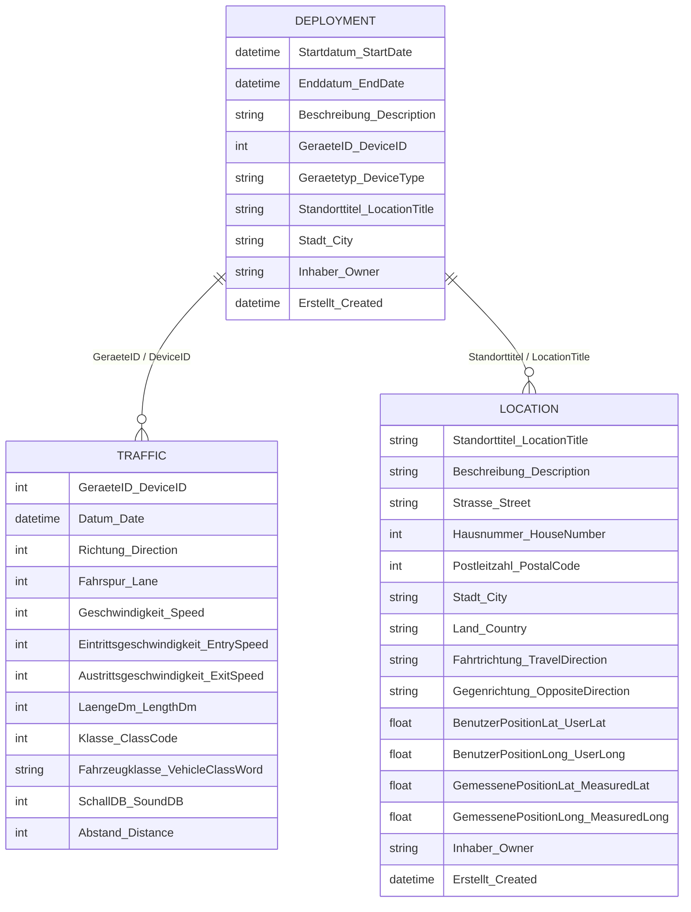

# Data Structure

## Sample Data

**Deployment (Auftrag in data folder)**
| Startdatum | Enddatum | Beschreibung | Geräte-ID | Gerätetyp | Standorttitel | Stadt | Inhaber | Erstellt |
|---|---|---|---|---|---|---|---|---|
| *Start Date* | *End Date* | *Description* | *Device ID* | *Device Type* | *Location Title* | *City* | *Owner* | *Created* |
| 28/01/2022 13:00:00 | 29/04/2023 11:00:00 | Fahrtrichtung Nord | 6429 | DD.plus | Albanstraße Nr. 23 DD 6429 | Berlin Tempelhof-Schöneberg | | 28/02/2022 13:23:57 |
| 25/02/2022 14:00:00 | 18/03/2023 08:00:00 | Fahrtrichtung-Süd | 5949 | DD.plus | Bahnstraße Nr. 10 DD 5949 | Berlin Tempelhof-Schöneberg | | 28/02/2022 13:26:39 |
| 27/04/2021 11:10:00 | 01/01/2049 00:00:00 | i.H.-HNr. 4 | 5951 | DD.plus | Boelkestraße Nr. 58 Fr-Ri. Süd DD 5951 | Berlin Tempelhof-Schöneberg | | 28/07/2023 15:41:38 |
| 04/05/2021 11:10:00 | 01/01/2049 00:00:00 | Fahrtrichtung Nord | 5950 | DD.plus | Boelkestraße Nr. 65 Fr. Nord DD 5950 | Berlin Tempelhof-Schöneberg | | 05/05/2021 10:12:33 |
| 13/03/2026 13:00:00 | 01/01/2049 00:00:00 | DD 5949 Halker Zeile | 5949 | DD.plus | DD 5949 Halker Zeile | Berlin Tempelhof-Schöneberg | | 17/03/2026 09:44:25 |
| 16/08/2025 14:00:00 | 14/03/2026 10:00:00 | in Hö. H.-Nr. 24 | 7871 | DD.plus | DD 7871 Monopolstraße Fr. Süd | Berlin Tempelhof-Schöneberg | | 26/08/2025 08:15:16 |
| 14/03/2026 13:00:00 | 01/01/2100 23:59:59 | DD 7871 Schulenburgring | 7871 | DD.plus | DD 7871 Schulenburgring | Berlin Tempelhof-Schöneberg | | 17/03/2026 09:55:50 |
| 16/08/2025 14:00:00 | 14/03/2026 11:00:00 | Fahrtrichtung Nord | 7872 | DD.plus | DD 7872 Monopolstraße Fr. Nord | Berlin Tempelhof-Schöneberg | | 26/08/2025 08:02:55 |

**Location (Standort in data folder)**
| Standorttitel | Beschreibung | Straße | Hausnummer | Postleitzahl | Stadt | Land | Fahrtrichtung | Gegenrichtung | Benutzer Position Lat | Benutzer Position Long | Gemessene Position Lat | Gemessene Position Long | Inhaber | Erstellt |
|---|---|---|---|---|---|---|---|---|---|---|---|---|---|---|
| *Location Title* | *Description* | *Street* | *House No.* | *Postal Code* | *City* | *Country* | *Travel Direction* | *Opposite Direction* | *User Lat* | *User Long* | *Measured Lat* | *Measured Long* | *Owner* | *Created* |
| Albanstraße Nr. 23 DD 6429 | Tempo 30 Zone | Albanstraße | 25 | 12277 | Berlin Tempelhof-Schöneberg | Deutschland | Grillostraße | Säntisstraße | 52.414429 | 13.379281 | 0.00 | 0.00 | | 28/02/2022 13:22:22 |
| Bahnstraße Nr. 10 DD 5949 | i.H. S-Bahnhof | Bahnstraße | 10 | 12277 | Berlin Tempelhof-Schöneberg | Deutschland | Hranitzkystrae | Kiepertplatz | 52.422564 | 13.374872 | 0.00 | 0.00 | | 28/02/2022 13:20:44 |
| Boelkestraße Nr. 58 Fr-Ri. Süd DD 5951 | i.H. Tempelherren-Grundschule Fr-Ri.: Süd 05.05.2021 | Boelckestraße | 5 | 12101 | Berlin Tempelhof-Schöneberg | Deutschland | Süd -Werner-Voß-Damm | Nord -Loewenhardtdamm | 52.478091 | 13.376559 | 0.00 | 0.00 | | 05/05/2021 10:09:02 |
| Boelkestraße Nr. 65 Fr. Nord DD 5950 | i.H. Fritz-Bräuning-Promenade Fr-Ri.: Nord 04.05.2021 | Boelckestraße | 65 | 12101 | Berlin Tempelhof-Schöneberg | Deutschland | Nord -Loewenhardtdamm | Süd -Werner-Voß-Damm | 52.478045 | 13.376915 | 0.00 | 0.00 | | 05/05/2021 10:03:45 |
| DD 5949 Halker Zeile | i.Hö. HNr. 12 | Halker Zeile | 12 | 12305 | Berlin Tempelhof-Schöneberg | Deutschland | Kettinger Straße | Buckower Chaussee | 52.411605 | 13.393485 | 0.00 | 0.00 | | 17/03/2026 09:40:57 |
| DD 7871 Monopolstraße Fr. Süd | in Hö. H.-Nr. 24 | Monopolstraße | 24 | | Berlin Tempelhof-Schöneberg | Deutschland | Schwalbenweg | Finkenweg | 52.449859 | 13.388690 | 0.00 | 0.00 | | 20/08/2025 21:41:25 |
| DD 7871 Schulenburgring | i.Hö. HNr. 115 | Schulenburgring | 115 | 12101 | Berlin Tempelhof-Schöneberg | Deutschland | Bayernring | Wolffring | 52.480597 | 13.382902 | 0.00 | 0.00 | | 17/03/2026 09:50:21 |
| DD 7872 Monopolstraße Fr. Nord | in Hö. H.-Nr. 62 | Monopolstraße | 62 | | Berlin Tempelhof-Schöneberg | Deutschland | Finkenweg | Schwalbenweg | 52.450091 | 13.388682 | 0.00 | 0.00 | | 20/08/2025 21:32:48 |
| DD 7872 Schulenburgring | i.Hö. HNr. 8 | Schulenburgring | 8 | 12101 | Berlin Tempelhof-Schöneberg | Deutschland | Wolffring | Bayernring | 52.481146 | 13.382839 | 0.00 | 0.00 | | 17/03/2026 09:58:27 |
| DD 8041 Handjerystraße | in Hö. H.-Nr. 23 | Handjerystraße | 23 | 12159 | Berlin Tempelhof-Schöneberg | Deutschland | Niedstraße | Albestraße | 52.473196 | 13.332578 | 0.00 | 0.00 | | 21/03/2025 08:13:14 |
| DD 8048 Tirschenreuther Ring | i.H. Marienfelder Grundschule | Tirschenreuther Ring | 71 | 12279 | Berlin Tempelhof-Schöneberg | Deutschland | Luckweg | Ahrensdorfer Straße | 52.410720 | 13.355099 | 0.00 | 0.00 | | 17/03/2025 14:57:39 |

**Traffic (Rohdaten in data folder)**
Several tables to be appended

| Geräte-ID | Datum | Richtung | Fahrspur | Geschwindigkeit (km/h) | Eintrittsgeschwindigkeit (km/h) | Austrittsgeschwindigkeit (km/h) | Länge (dm) | Klasse | Fahrzeugklassen-Bezeichnung | Schall (dB) | Abstand (cm) |
|---|---|---|---|---|---|---|---|---|---|---|---|
| *Device ID* | *Date* | *Direction* | *Lane* | *Speed (km/h)* | *Entry Speed (km/h)* | *Exit Speed (km/h)* | *Length (dm)* | *Class* | *Vehicle Class Name* | *Sound (dB)* | *Distance (cm)* |
| 5951 | 25/03/2026 00:19:54 | 1 | 0 | 0 | 62 | 70 | 42 | 7 | Pkw | 0 | 0 |
| 5951 | 25/03/2026 00:21:52 | 1 | 0 | 0 | 49 | 51 | 38 | 7 | Pkw | 0 | 0 |
| 5951 | 25/03/2026 00:51:22 | 1 | 0 | 0 | 37 | 43 | 38 | 7 | Pkw | 0 | 0 |
| 5951 | 25/03/2026 01:25:16 | 1 | 0 | 0 | 63 | 66 | 40 | 7 | Pkw | 0 | 0 |
| 5951 | 25/03/2026 02:11:20 | 1 | 0 | 0 | 41 | 51 | 42 | 7 | Pkw | 0 | 0 |
| 5951 | 25/03/2026 02:33:54 | 1 | 0 | 0 | 46 | 55 | 76 | 3 | Lkw | 0 | 0 |
| 5951 | 25/03/2026 02:49:16 | 1 | 0 | 0 | 23 | 24 | 20 | 230 | Fahrrad | 0 | 0 |
| 5951 | 25/03/2026 02:50:30 | 1 | 0 | 0 | 52 | 57 | 42 | 7 | Pkw | 0 | 0 |
| 5951 | 25/03/2026 02:57:58 | 1 | 0 | 0 | 52 | 72 | 41 | 7 | Pkw | 0 | 0 |
| 5951 | 25/03/2026 05:08:12 | 1 | 0 | 0 | 19 | 20 | 13 | 230 | Fahrrad | 0 | 0 |
| 5951 | 25/03/2026 05:09:10 | 1 | 0 | 0 | 32 | 30 | 42 | 7 | Pkw | 0 | 0 |
| 5951 | 25/03/2026 05:18:04 | 1 | 0 | 0 | 22 | 24 | 18 | 230 | Fahrrad | 0 | 0 |
