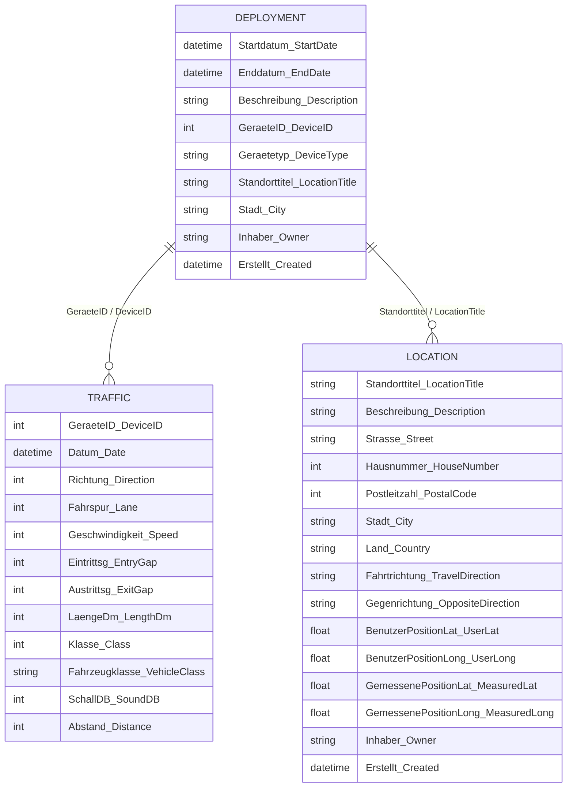

# Data Structure

## Sample Data

## Sample Data

**Deployment**
| Startdatum | Enddatum | Geräte-ID | Gerätetyp | Stadt | Erstellt |
|---|---|---|---|---|---|
| *Start Date* | *End Date* | *Device ID* | *Device Type* | *City* | *Created* |
| 28/01/2022 13:00 | 29/04/2023 11:00 | 6429 | DD.plus | Berlin Tempelhof-Schöneberg | 28/02/2022 13:23 |
| 25/02/2022 15:00 | 18/03/2023 08:00 | 5949 | DD.plus | Berlin Tempelhof-Schöneberg | 28/02/2022 13:26 |
| 27/04/2021 11:10 | 01/01/2049 00:00 | 5951 | DD.plus | Berlin Tempelhof-Schöneberg | 28/07/2023 15:41 |
| 04/05/2021 11:10 | 01/01/2049 00:00 | 5950 | DD.plus | Berlin Tempelhof-Schöneberg | 05/05/2021 10:12 |
| 13/03/2026 13:00 | 01/01/2049 00:00 | 5949 | DD.plus | Berlin Tempelhof-Schöneberg | 17/03/2026 09:44 |

**Location (Standort)**
| Standorttitel | Straße | Nr. | PLZ | Stadt | Fahrtrichtung | Gegenrichtung | Lat | Long | Erstellt |
|---|---|---|---|---|---|---|---|---|---|
| *Location Title* | *Street* | *No.* | *Postal Code* | *City* | *Travel Direction* | *Opposite Direction* | *Lat* | *Long* | *Created* |
| Albanstraße Nr. 23 DD 6429 | Albanstraße | 25 | 12277 | Berlin Tempelhof-Schöneberg | Golißstraße | Säntisstraße | 52.414429 | 13.379281 | 28/02/2022 13:22 |
| Bahnstraße Nr. 10 DD 5949 | Bahnstraße | 24 | 12277 | Berlin Tempelhof-Schöneberg | Kiepernstraße | Kiepernstraße | 52.422564 | 13.374872 | 28/02/2022 13:20 |
| Boelkestraße Nr. 58 DD 5951 | Boelkestraße | 5 | 12101 | Berlin Tempelhof-Schöneberg | Süd -Werner-Voß-Damm | Nord -Loewenhardtdamm | 52.478091 | 13.376559 | 05/05/2021 10:09 |
| Boelkestraße Nr. 65 DD 5950 | Boelkestraße | 65 | 12101 | Berlin Tempelhof-Schöneberg | Nord -Werner-Voß-Damm | Süd -Loewenhardtdamm | 52.478045 | 13.376915 | 05/05/2021 10:03 |
| DD 5949 Halker Zeile | Halker Zeile | 12 | 12305 | Berlin Tempelhof-Schöneberg | Kettinger Straße | Buckower Chaussee | 52.411605 | 13.393485 | 17/03/2026 09:40 |

**Traffic (Verkehr)**
| Geräte-ID | Datum | Richtung | Länge (dm) | Klasse | Fahrzeug |
|---|---|---|---|---|---|
| *Device ID* | *Date* | *Direction* | *Length (dm)* | *Class* | *Vehicle* |
| 5951 | 25/03/2026 00:19:54 | 1 | 42 | 7 | Pkw |
| 5951 | 25/03/2026 00:21:52 | 1 | 38 | 7 | Pkw |
| 5951 | 25/03/2026 00:51:22 | 1 | 38 | 7 | Pkw |
| 5951 | 25/03/2026 02:33:54 | 1 | 76 | 3 | Lkw |
| 5951 | 25/03/2026 02:49:16 | 1 | 20 | 230 | Fahrrad |
